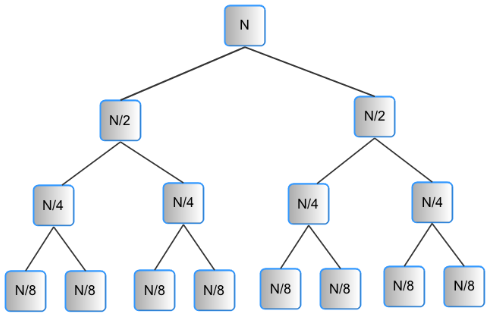
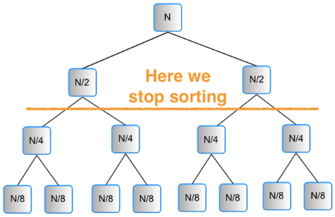
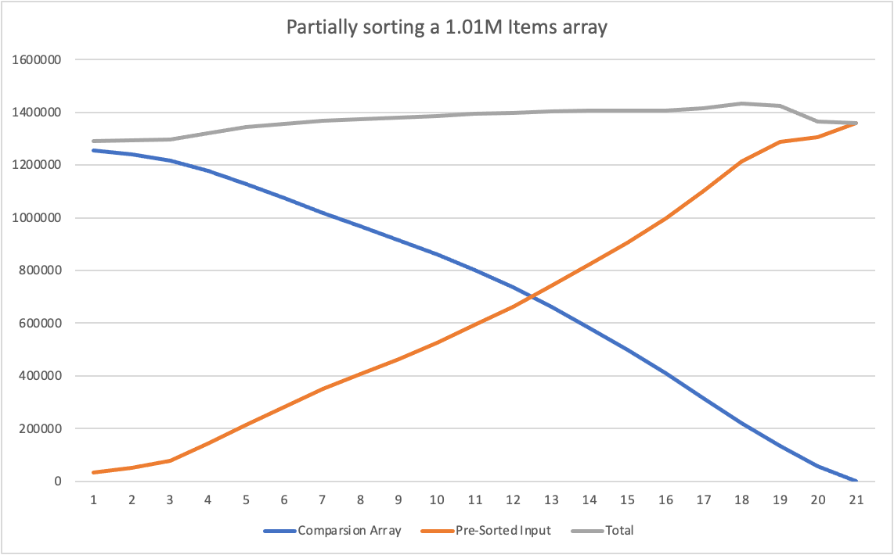
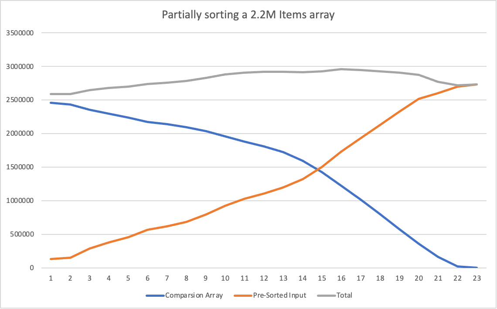

## Introduction

Towards the end of 2023, I was trying efficient ways to compress geometry for 3D meshes. This was done as part of some research in [xeokit-sdk](https://github.com/xeolabs/xeokit-sdk).

The context was the creation of a new 3D model format that surpassed the XKT format ([I also developed the XKT format back in 2019](https://github.com/xeokit/xeokit-sdk/issues/48)) in terms of file size.

The idea, was to check if pre-sorting the data arrays corresponding to the 3D meshes' indices, when compressed with standard compression algorithms (zlib, Brotli, ...), could result in a smaller compression size.

Indices arrays are special in the sense that they just contain vertex indices, and the same vertex is usually referenced several times, so the amount of data repetition is high. And, pre-sorting this kind of array usually gives a much better compression result (this is an easy experiment to do)!

Although the experiment did not work, an interesting effect on the compressed data size was observed, and this article describes it.

It is how the resulting compressed size, related to the data entropy, seems to have two dimensions: a) the "data variability" dimension and the "data order-ness" dimension.

## TLDR

When we want to compress data, if the data has a small set of different values (like the ones related to the indices arrays of a set of meshes), the compressed size is much smaller if we pre-sort the data.

Then, we would need to somehow reconstruct the original data from its sorted version, and for this we need some auxiliary data that allows the reconstruction.

The auxiliary data, in a sense carries the "orderness", and the sorted data carries the "variability" of the data (their different values).

What has been observed, is that the sorted data plus the auxiliary data has the same compressed size as the original data. Furthermore, we can partially only sort the data so it will be "less ordered" and the auxiliary data will need to carry less reconstruction information; and, still, the compressed size is the same.

As the compressed size relates to the entropy of the data, what's interesting looking at both datasets (the pre-sorted one and the auxiliary one), is that we can gradually transfer entropy from the original data into the auxiliary data, controlling the "amount of order" that we want in the pre-sorted array. And still, the compressed size remains similar.

This means that entropy-wise, we can see two dimensions in any data: its "variability dimension" and its "order dimension". And that we can apply rotations in this two-dimensional plane to control where we store the "order" component of the entropy!

The rest of the article shows more details about this result.

## Let's begin!

Imagine the following array:

```json
[ 3, 1, 1, 2, 3, 3 ]
```

The above array compresses well, but can we improve it?

If we order the array, we end up having this:

```json
[ 1, 1, 2, 3, 3, 3 ]
```

And this kind of 2nd array compresses much better because we have consecutive repeated elements, so dictionary-based compression algorithms feel at home with them and give really high compression ratios!

And this was the key observation that triggered the experiment: could live with the the sorted data and try to find a way to reconstruct the original order from the sorted one? For that, we would need some auxiliary data that allowed us to do the reconstruction.

Following the example, we could use the following auxiliary array (it tells the original position of each item in the sorted array):

```json
[  1, 2, 3, 0, 4, 5 ]
```

This is was a very simple example on the kind of auxiliary data that can be used to reconstruct the original array, but it illustrates the point. And, the problem with this example auxiliary array is that it indeed takes a lot of space when compressed.

To continue the question that started the experiment: is it possible to produce instead a more elaborated auxiliary data array? So let's jump into an attempt to produce it.

## Continuation: reconstructing the original array from the sorted one

When we're sorting our array, we use to use some standard function like `quicksort` or `merge-sort` to order it.

There are different standard sorting algorithms and all of them produce the same final sorted array.

One interesting fact about them, is that they usually allow us to provide a comparison function like the following:

```ts
function fnCompare (a: number, b: number): bool {
    return a < b;
}

// we have some array "arr"

arr.sort(fnCompare)

// now "arr" is sorted
```

The function, is used to determine the relative order between pairs of elements. The previous function would result in an array sorted in ascending order. But if instead `return a > b;` was used, the resulting array would be ordered in descending order.

There is a nice thing about the comparison function and it is that it can cause side effects, like storing each pair comparison:

```ts
let cmpResults: bool[] = [];

function fnCompare (a: number, b: number): bool {
    const retVal = a < b;
    cmpResults.push(retVal);
    return retVal;
}

arr.sort(fnCompare);
```

We could see sorting an array as rearranging it, and at the end of the code above, the `cmpResults` array contains the sequence of comparison results that resulted in "the rearranging that ordered the concrete array".

So, storing those comparisons, is like "caching" the inputs to that rearrange process.

To illustrate the point, imagine we were sorting again the original array and, instead of computing `a < b`, we kept returning each item in `cmpResults`:

```ts
let cmpResults = ...; // already initialized
let index = 0;

// will return each time the cached element
function fnCompareCached(a: number, b: number): bool {
    return cmpResults[index++];
}

// "arr" is the original array

arr.sort(fnCompareCached);

// now, "arr" is *also* sorted in ascending order!
```

But, what we're interested in, is in reconstructing the original array from the sorted one. In this case, if we apply `fnCompareCached` to an increasing sequence...

```json
[ 0, 1, 2, 3, 4, ... ]
```

... the increasing sequence will be rearranged so the result is the mapping between the original data array and the sorted data array!

## But, it is inefficient to compress the cached comparisons

The previous idea indeed works if we want to sort our data plus have an auxiliary array with which we can reconstruct the original data arrangement from its sorted version.

The size of the comparison-cache array, will mostly depend on the runtime performance of the sorting algorithm we use, and to continue the experiment merge-sort was chosen, because it offers a constant O(n·log n) runtime.

_O(n · log n) is the best average run-time a comparison-based sort algorithm can get, and e.g. quick-sort, for example, has instead a worst-case of O(n²)_.

The number of items in the comparison cache, will be the number of comparisons done by the sorting algorithm (this is, the number of times it calls `fnCompare`), so it is expected that the number of items in the array is big!

For example, if we're sorting 2M items, we'll end up with around 40M items in the comparison-cache array, and this kind of array (if we model `false == 0` and `true == 1`) produces a big-sized compression result.

So, it is not enough to compress the comparison cache and keep it together with the compressed sorted array. Something more is needed.

## TLDR; a bit of brainstorming

What was done instead, is to notice the comparison cache will have series like the following:

```json
[ false, false, false, true, true, true, true, false, true, true, true ]
```

And to realize that it's usually made of runs of `true` / `false` values. So an idea is to encode this array with the number of times each `true` or `false` is repeated:

```json
[ 3, 4, 1, 3 ]
```

And, this array is a quite smaller one to compress.

But, this is not enough to compress the array with a good size.

From here, some more strategies were done to compress the comparison array, but to avoid boring explanations about bit-encoders, RLE, etc... the explanation will be skipped.

Is't all a matter of finding better ways to compress the comparison array.

## Let's go to business: initial results

In this experiment, we have two scenarios:

- a) on one side, the original array, compressed

- b) on the other size, two compressed arrays: the original array, sorted and compressed; and the comparison array, compressed

The initial goal was to see if the combined size of `b)` could improve the size of `a)`.

And, turns out that quite not!

When compressing the data with `pako.js`' `deflate` function, `b)` produces a smaller size, even though not much smaller.

When using Brotli compression instead, `a)` produces a smaller size, even though again not much smaller.

So, even though similar, we more or less kept the same size in both approaches.

`a)` compresses the original data as-is

`b)` produces a combination of compressed artifacts, and this interesting! 

In the case of `b)`, we're separately producing two arrays:

- the 1st, is the sorted original array, with repeated elements close to each other

- the 2nd, relates to the ordering of the original data, where each element should go

And, more or less the total sizes of `a)` and `b)` are equal.

As the compressed size relates to the amount of entropy in the data being compressed, what we've done in `b)` is to split the entropy in two dimensions:

- the 1st dimension relates to the entropy in the diversity of the original data: how many different elements the data has

- the 2nd dimension relates to the entropy in the ordering of the original data: how much scrambled the data is

As it will be further explained, this is something really interesting: we're able to strip out the order of the original data into an auxiliary structure but without modifying the total entropy!

For example, for a couple example mesh indices' data arrays, those are the results (with pako.js' deflate):

| Dataset        | [1] Original Compressed Size | [2] Pre-Sorted + Comparison-Cache Compressed Size |
|----------------|------------------------------|---------------------------------------------------|
| a) 1.01M items | 1360157                      | 1291549                                           |
| b) 2.20M items | 2734266                      | 2589982                                           |

- **[1]** is the resulting size if we compress the original array
- **[2]** is the sum of the sizes of the compressed pre-ordered array and the compressed comparison cache array

This is the main result of the article. Instead, if Brotli compression is used the original compressed size would be smaller. And due to this, this strategy was discarded for the creation of a new compressed format (as there is virtually no gain in the final compressed size).

Nevertheless, thought it was worth the effort to keep experimenting a bit and extend the experiment, as I was curious about what would happen if we only partially sorted the original data array.

Curious? Then keep reading!

## Further experimentation: gradual entropy transfer

So, it would be interesting to only partially sort the original array and see how many bytes go into each of the a) the pre-sorted (now partially) array, and b) the auxiliary array.

The core idea behind partially sorting the input array is that the sort algorithm will do less comparisons, so the auxiliary array will contain less `true` / `false` items and thus be smaller.

And, how can this be done? Can we really only partially sort an array?

And this is another reason why merge-sort was chosen as the algorithm for the whole experiment.

Merge-sort will recursively subdivide the input array to have arrays of size 1 (which are always sorted), then in the inverse recursive way keep merging the sub-arrays into a bigger one, knowing that the sub-arrays will be already sorted:



And, is this recursive nature of merge-sort that allows us to only partially sort the input array.

Imagine that we stop merge-sort at a certain recursion depth:



In the image, all sub-arrays corresponding to a size of up to N/4 will be sorted, but not the bigger arrays of size N and N/2. So, globally, the array will be sorted "to a certain extent".

And, it is easy to introduce such early stop into merge sort by adding something like a `depth` variable to its `merge` part function.

So, it's time to prepare a couple charts with this recursion-stop technique

## The final result

In the following charts, the following is displayed:

- the horizontal axis, shows how many recursion levels to we allow merge-sort to do. This is, if the horizontal axis is `x`, merge-sort will sort sub-arrays of up to 2^x in size.

- the orange curve, shows the compressed size of the pre-sorted input, applying the recursion limitation.

- the blue curve, shows the compressed size of the auxiliary array (the comparison-cache), applying the recursion limitation.

- and, the grey curve shows the total compressed size (the orange plus the blue curve)





Notice how by only partially pre-sorting the array, merge-sort does less comparisons so the auxiliary comparison-cache is smaller. But then the size of the pre-sorted array is bigger as the data is not "so predictable" to `deflate`'s algorithm.

The total size, as we sweep on the horizontal axis, remains more or less constant and, as the compressed size relates quite directly with the amount of entropy in the data...

... this means that we can "move" entropy between the "order dimension" contained in the auxiliary array and the "variability dimension" contained in the pre-sorted array.

Quite interesting observation, isn't it?

(even though, the experiment was a failure when it comes to the goal of a better mesh storage format)

Thanks for reading!

## License

© [Toni Martí Coll](https://www.linkedin.com/in/toni-mart%C3%AD-392604103/), 2024.

Licensed under [CC BY-SA License](https://creativecommons.org/licenses/by-sa/4.0/)

