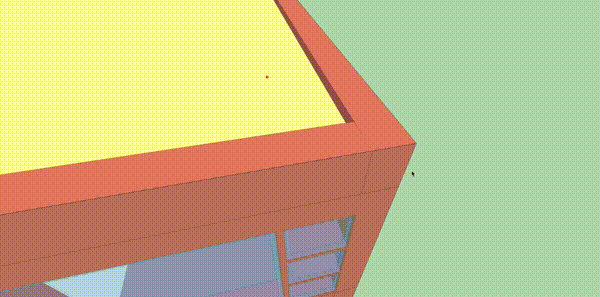
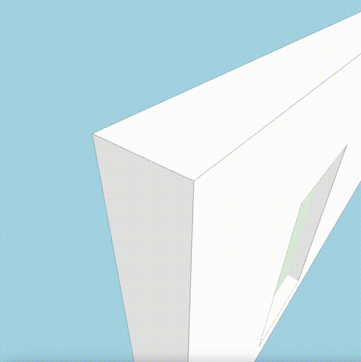
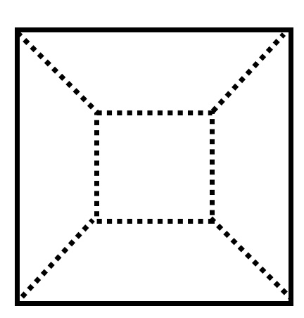
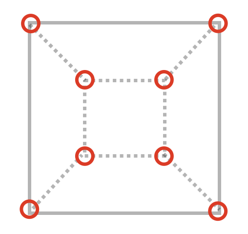
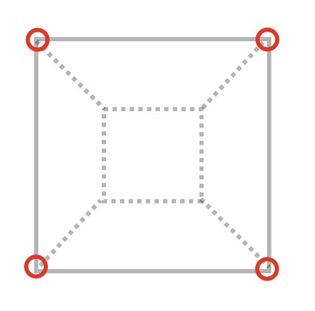
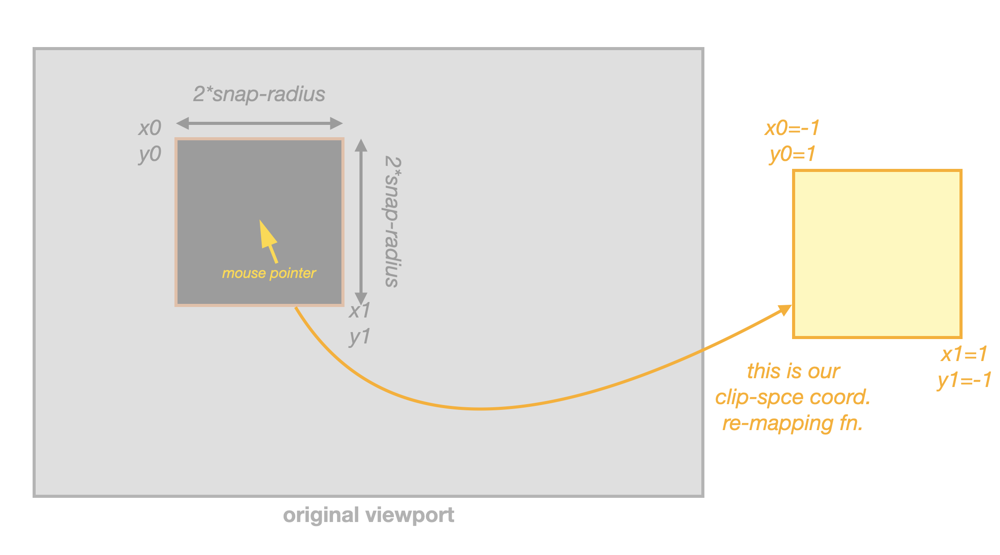

## Introduction

It is a common need in 3D engines to offer the possibility of snapping the mouse cursor to the closest visible edge or vertex!

For example snapping to vertices allows for precise measurements when obtaining the distance between, say, two corners of a wall in a 3D model.

### 🎬 _This is vertex-snap_: The red ball will stick to the closest vertex.



### 🎬 _And this is edge-snap_: The red pointer will stick to the closest edge.



## TLDR; ouline of will be explained in this article

This article explains how a mostly GPU-based approach for vertex and edge snapping can be implemented in WebGLv2.

The peformance of this technique should be faster than rendering 2 frames of the scene (one to initialize a Z-buffer with `gl.TRIANGLES` and the other to draw vertices with `gl.POINTS`). No additional constructs are needed apart from a couple shaders (for the 2 frame renders above), and there is no need of initializing any other programmatic object apart from a render target and the shaders themselves.

The implementation dicussion will follow this sketch:

- first, a small discussion on traditional techniques using kd-trees vs. a GPU-based implementation

- then, an attempt to highlight that GLSL shaders can be used for more than just color rendering, with some considerations on the compute model that GLSL brings

- finally the real deal. The steps to do a GPU-based implementation of vertex/edge snapping.

  - GPU: rendering vertex coordinates instead of positions
  - GPU: pre-initializing the Z-buffer
  - GPU: clip-space re-mapping in the vertex shader
  - CPU: getting the closest vertex to the cursor
  - bonus track: method extension, or how to edge-snap "for the same price"

Finally the Gtihub link to the 1st implementation where this technique was applied in [The xeokit-sdk 3D engine](https://github.com/xeokit/xeokit-sdk) will be provided, feel free to then be curious.

## KD-Trees, a "traditional" approach

Traditionally, at least to my knowledge, a common approach is to keep an off-the-GPU copy of all the geometry, and based on that build some data structure (kd-trees, oct-trees, ...). Then, at query time, ask the data structure what is the coordinate of the closest vertex to a given ray. Alternatively, the 2D projection of the scene geometry vertices based on the camera position and can be dumped into a 2D kd-tree and then do a point-nearest search.

There are several problems with this "traditional" approach:

- you must keep a copy of all the geometry **also** in main RAM (outside of the VRAM), so you can query it in the traditional "programming language" way (e.g. Javascript in case of WebGL engines to query the kd-tree). As the geometry needs to the be in the VRAM anyway, this means you end up using twice as memory as needed (one copy in the VRAM and one copy in browser RAM), plus the additional space for the data structures.

- managing a kd-tree means running code outside the GPU, and code outside the GPU means not being able to leverage the massive parallelism available in most modern GPU's. And even moderately cheap GPU have a good number of parallel shader units nowadays!

- of course, you must initialize the auxiliar data structure, and that just adds up to the time it takes to initialize and load the models in your 3D viewer (or anyway do it in a lazy way).

This article instead presents an original and new way for a snapping functionality (both vertex and edge snapping) that mostly runs on the GPU. It's based on the new possibilities available in WebGLv2, where we can have our Fragment Shaders output not only colors but actually a much more diverse kind of values.

## Rendering colors from the Fragment Shader?...

For graphics R&D, WebGLv2 opens an enormous horizon in front of you, if you're just creative with the way you use your Vertex and Fragment Shaders. 

Traditionally, when using GLSL to draw 3D objects, you transform & light triangles using the Vertex Shader, and draw those triangles into some render buffer with the Fragment Shader.

So, the historical role of the Fragment Shader is to take the clip-space position of every point in your geometries' triangles and convert that to some color that you want to display on the screen.

But there's no need to fully stick to this model. Instead,  within the computing model limitations of GLSL, you can really transform your geometry data in many different ways. There are plenty of tutotials [like this one](https://webgl2fundamentals.org/webgl/lessons/webgl-gpgpu.html) that show these possibilites. Also for example [TensorFlow.js](https://github.com/tensorflow/tfjs) takes this approach to the extreme of just converting GLSL shaders into a parallel computing backend for the JS version of TensorFlow.

## ... no! Rendering positions instead of colors!  (part i)

So, let's go the main dish in this article.

Let's se how we render a traditional 3D scene with WebGL:

- 1: you load the geometry into the VRAM

- 2: you set some camera position and illumintation conditions

- 3: you invoke the WebGL render methods (drawing `gl.TRIANGLES`):

  - 3.1: probably, your Vertex Shader will convert your 3D triangles into screen (clip-space) positions. This will involve camera matrices, illumination, etcl etc... A bit of algebra, and a fragment will be then emitted for each "point" that "fills" each rendered triangle.

  - 3.2: and probably, your Fragment Shader will give a concrete color to each of the "points" inside the triangle.

Very simplisticly explained, but ``3.1`` and ``3.2`` will fill triangles on the screen because we probably invoked the following WebGL method:

```js
gl.drawArrays(gl.TRIANGLES, ...);
```

The `gl.TRIANGLES` above tells WebGL that the Vertex Shader will emit vertices positions in packs of 3, and that those 3 vertices are the coreners of a triangle. Then, the Fragment Shader will "fill" the interior of the rectangle, allowing to tune the color of each "point" inside the triangle.

If we instead did this...

```js
gl.drawArrays(gl.POINTS, ...);
```

... we would be telling the Vertex Shader to treat each vertex separately, and send just 1 vertex at a time to the Fragment Shader. On the screen, the result would not be that triangles would be filled, but that individual points (one for each vertex) would be drawn on the screen!

So it's easy to see here that:

- using `gl.TRIANGLES` will draw triangles
- using `gl.POINTS` will draw individual points
- and, unsurprinsingly, using `gl.LINES` will draw... well, line segments

This last point seems pretty obvious, right? :) Then keep reading!

## Dramatic pause: compute model of GLSL

I don't want to be really boring with technical details here, but think a bit what we are enforced to do with the compute model involving GLSL shaders.

We have two computing stages (at least in WebGL; OpenGL or WebGPU might have additional stages such as Geometry Shaders, etc.. ):

- the Vertex Shader
- and the Fragment Shader

When we call the `gl.draw*` methods in WebGL (v1/v2), we're actually letting WebGL to 3 basic kinds of stuff:

- with `gl.TRIANGLES`, invoke the Fragment Shader for the 2D sub-space that fills a triangle generated by the Vertex Shader
- with `gl.LINES`, invoke the Fragment Shader for the 1D sub-space that fills a line segment generated by the Vertex Shader
- with `gl.POINTS`, invoke the Fragment Shader for the 0D sub-space (a point!) received from the Vertex Shader

With that you draw objects on the screen, yes, and this is a very straightforward concept: drawg triangles, lines, or points.

But here is the point: it's not the only possible interpretation.

The model yes enforces you to call the Fragment Shader for 2D region, 1D region, or 0D region. But the real power comes from realising this is not necessarily a visible 2D region, or that this 2D region is a region of the screen where the triangle will be drawn, or that you need "to fill the 2D region with some visible color".

2D areas, 1D segments, or 0D points can just be seen in a bit more abstract way than graphical artifacts.

And this computing model introduces very characteristic thingies such as optional depth tests (Z-buffer), which depending on your compute needs might be intresting to enable, or disable.

But if you can rethink certain algorithms to fit in this compute model, you get the power of massivaly parallel computing even on mid-range mobile devices.

Thinking about GLSL as "how I can implement this and that algoritm in a massive parallel way?" is tricky and full of details: shaders are stateless by nature; you must stick to the 2D/1D/0D regions concept; how can you take advantage of stencil/z buffers; you need to to "block processing" instead of "stream processing" in some cases (because of the lack of state). It's not the "traditional" compute model where you can have very flexible loops, recursion, shared state, pointers, persistent storage, etc... but it can be really fun to rethink those application in terms of the limitations/benefits GLSL gives.

Keep reading! Let's get back to "rendering positions"!

## Rendering positions instead of colors! (part ii, coordinates)

How does all that with fit within vertex/edge snapping?

Remember the "traditional scene render":

>
> Let's se how we render a traditional 3D scene with WebGL:
>
> - 1: you load the geometry into the VRAM
>
> - 2: you set some camera position and illumintation conditions
>
> - 3: you invoke the WebGL render methods  (drawing `gl.TRIANGLES`):
>
>   - 3.1: probably, your Vertex Shader will convert your 3D triangles into screen (clip-space) positions. This will involve camera matrices, illumination, etcl etc... A bit of algebra, and a fragment will be then emitted for each "point" that "fills" each rendered triangle.
>
>   - 3.2: and probably, your Fragment Shader will give a concrete color to each of the "points" inside the triangle.
>

Now let's do a couple changes:

```diff
- 3: you invoke the WebGL render methods  (drawing `gl.TRIANGLES`):
+ 3: you invoke the WebGL render methods  (drawing `gl.POINTS`):
...
- 3.2: and probably, your Fragment Shader will give a concrete color to each of the "points" inside the triangle.
+ 3.2: and, your Fragment Shader will output the position of the Vertex.
```

The fact that we can render coordinates instead of colors, is just because in WebGLv2 your renderbuffer can accept many different color formats!

- 8-bit RGBA integer channels (the traditional color renderbuffers)
- 16-bit only-R channel (hmmm...)
- 32-bit RGBA float channel (hmmm...)
- etc etc etc

The list of possibilities is big and you can google it, even though for example support for float render formats can be somewhat limited across devices.

In WebGLv2, it is mandatory for driver conformance to at least support some of the extended color formats (with respect to WebGLv1). While it's possible not all devices support 32-bit **float** RGB(A) components, there is good general support for 32-bit **integer** RGB(A) components.

So, even though it would be nice to render the coordinates as **float** components, we can just re-map them to take the full range of a 32-bit integer variable.

For example from our Fragment Shader:

```cpp
#version 300 es

// this is the vertex world position emitted from the Vertex Shader
in vec3 vertexPos;

// this is the maximum absolute value the vertices' coordinates will take
uniform vec3 range;

// remember we're generating 32-bit RGB components from the Fragment Shader
out ivec4 outCoords;

// the maximum absolute value an int-32 variable can take
#define INT32_MAX_ABS_VALUE ((1 << 31) - 1)

void main(void) {
    outCoords = ivec4(vertexPos.xyz / range.xyz * INT32_MAX_ABS_VALUE, 1);
}
```

This is the basic remapping from-to float-int32, even though additional considerations need to be taken in order to have joint support for example when using batched rendering, scenes using big coordiantes e.g. with Relative-to-Center rendering, ... But those can just be left as an exercise for you the reader :)

Curious about the `1` in the 4th component of the output vector from the Fragment Shader? Keep reading please! 

## Rendering positions insted of colors (part iii, bonus track: render target)

As we can choose what is our render buffer format color, nothing prevents us from using 32-bit components for each of the RGB channels.

When we do "traditional renders", each of the RGBA channels is a 8-bit unsigned integer becase, well, most commonly we use 256 different values for red, green, blue and alpha components.

But, if we want to output positions and want more precision than what 2^8 different values give, we can just stick to 32-bit components for each channel.

When preparing a traditional texture as the target for "traditional rendering", we would do something like this", where each of the RGBA channels is an 8-bit unsigned integer

```js
// a) set-up the texture where things will be rendered
const tex = gl.createTexture();
gl.bindTexture(gl.TEXTURE_2D, tex);
// This sets up the "standard" 8-bit RGBA components
gl.texImage2D(gl.TEXTURE_2D, 0, gl.RGBA, width, height, 0, gl.RGBA, gl.UNSIGNED_BYTE, null);
// Maybe also disable mip-maps and wrappping
// ...

// b) set-up the render bufer with some 16-bits Z-buffer
const renderBuffer = gl.createRenderbuffer();
gl.bindRenderbuffer(gl.RENDERBUFFER, renderBuffer);
gl.renderbufferStorage(gl.RENDERBUFFER, gl.DEPTH_COMPONENT16, width, height);

// c) and glue it all in a frame buffer
const frameBufer = gl.createFramebuffer();
gl.bindFramebuffer(gl.FRAMEBUFFER, frameBufer);
// This attaches the texture as the destination of the frame buffer
gl.framebufferTexture2D(gl.FRAMEBUFFER, gl.COLOR_ATTACHMENT0, gl.TEXTURE_2D, tex, 0);
// And, this will back the frame buffer with the Z-buffer of the render buffer
gl.framebufferRenderbuffer(gl.FRAMEBUFFER, gl.DEPTH_ATTACHMENT, gl.RENDERBUFFER, renderBuffer);
```

Instead, it's really easy to change it so it can "receive" 32-bits integer data.

```diff
- // This sets up the "standard" 8-bit RGBA components
- gl.texImage2D(gl.TEXTURE_2D, 0, gl.RGBA, width, height, 0, gl.RGBA, gl.UNSIGNED_BYTE, null);
+ // This configures it to receive 32-bit integer RGBA components
+ gl.texStorage2D(gl.TEXTURE_2D, 1, gl.RGBA32I, width, height);
```

## Rendering positions insted of colors (part iv, what happened here?)

So, we did a couple changes to the "traditional render" scheme and ended up with this (changes in bold):

>
> Let's se how we render a traditional 3D scene with WebGL:
>
> - 1: you load the geometry into the VRAM
>
> - 2: you set some camera position and illumintation conditions
>
> - **3: you invoke the WebGL render methods  (drawing `gl.POINTS`)**:
>
>   - 3.1: probably, your Vertex Shader will convert your 3D triangles into screen (clip-space) positions. This will involve camera matrices, illumination, etcl etc... A bit of algebra, and a fragment will be then emitted for each "point" that "fills" each rendered triangle.
>
>   - **3.2: and, your Fragment Shader will output the position of the Vertex**.
>

What the heck happened when doing those two changes?

The result, is that we'll still have a WxH render target, where W is the viewport width and H is the viewport height.

Only that, in each output texel (for, "pixel in the output texture") we'll have the position of the vertex that is closest to the camera. Why that? Because of the Z-buffer!

Imagine we had the following situation in 1D-space, where our render buffer has a size of 1x1 texel and A, B, and C are vertices:

```
   📹 -----------> 👀   A   B  C
   ↓               ↓
cam. eye    cam. direction
```

If we "rendered" this 1D-scene with depth tests enabled, in our only output texel we would get the "A" vertex drawn (because that't the one closer to the camera). Or, more precisely, its coordinates if we instead rendered coordinates as explained above.

Now, menthally extend that to a 3D render, and the result will be that in our "coordinates target texture" we will have the coordinates of the vertices closer to the camera in the ray that goes from the camera eye and passes through that texel.

Now, how do we know that in that texel we didn't "render" the coordinates of any vertex?

Remember the misterious 4th component with value `1` in the Fragment Shader?

```cpp
outCoords = ivec4(vertexPos.xyz / range.xyz * INT32_MAX_ABS_VALUE, 1);
```

We can use that `1` in order to know that the coordinates of a vertex were drawn in that textel! So we just need to pre-clean it to `-1` just before calling our shader putting in out 32-bit integer RGBA render target 4th component e.g. like this:

```js
// after binding our render target

// this will make sure the 4th component in the render target is initialized to `-1`
gl.clearBufferiv(gl.COLOR, 0, new Int32Array([0, 0, 0, -1 ]));

// now invoke our "coordinates renderer"
gl.draw[Arrays/Elements] (gl.POINTS, ...);
```

So, we will know that a vertex is found at that texel just by knowing that the 4th component we read is a `1` and not a `-1`.

## Pre-initializing the Z-buffer (i, Z-values)

Right now, so far, we could read back the result of our "coordinates render" with some code like this one:

```js
// Let's prepare a buffer where to read the texture data
const data = new Int32Array( // the render target made of 32-bit integers
  viewportWidth *
  viewportHeight *
  4 // we have 4 components per texel (this is, RGBA)
);

gl.readPixels(
  0,
  0,
  viewportWidth,
  viewPortHeight,
  gl.RGBA_INTEGER,
  gl.INT
  data, // we'll read the data in our buffer
  0
);
```

What we get with that, is just a buffer that corresponds to the data in our coordinates render, and we know that if the 4h componet is `1`, we have a vertex there.

But, that is problematic. Take this schematic render of a cube:



Our "coordinates renderer" will render a vertex in each of the following red circles:



But the truth is that we want to implement a snap-to functionality, and we don't want to snap to occluded elements, do we?

We should be only rendering vertices that are not occluded by any geometry during a "regular render", something like this picture where we ignore the hidden vertices:



So we have to find a way so regular geometry (triangles) occludes non-visible vertices.

Remember when we saw this example before?

>```
>   📹 -----------> 👀   A   B  C
>   ↓               ↓
>cam. eye    cam. direction
>```

Vertex `A` was the one we finally present in our 1x1 render target because "it won the Z-fight", as it is the closest to the camera. And this means that the Z buffer is our ally here!

Until now we saw we can initialize the viewport for the render target with a `-1` in the 4th component(by using `gl.clearBufferiv`; this we made to be able to know if in a certain output texel there is a vertex or not).

But, we can also pre-initialize the Z-buffer! We want the Z-buffer help us here to avoid drawing vertices that are bahind the geometry. And, how can we use the Z-buffer for that purpose? Well, just by initializing it with a regular render!

Our "traditional render" pipeline will be composed probably of a certain combination of Vertex and Fragment Shaders, in charge of finally assigning a color to each screen pixel.

What if we do something like this for snapping purposes?

```diff
// after binding our render target

// this will make sure the 4th component in the render target is initialized to `-1`
gl.clearBufferiv(gl.COLOR, 0, new Int32Array([0, 0, 0, -1 ]));

+// first, invoke the "Z-buffer initializer" shaders
+gl.draw[Arrays/Elements] (gl.TRIANGLES, ...)

// now invoke our "coordinates renderer"
gl.draw[Arrays/Elements] (gl.POINTS, ...);
```

Ideally, the "Z-buffer initializer" shaders should render the geometry in the regular way, but we can save some compute time there:

- no need for illumination computations
- no need for SFX
- ...

These shaders should only render the geometry "as is", as the goal is to only pre-set the Z-buffer values on each texel of the output texture.

And here we have a small problem. Just in the position of the vertices, the Z component for the vertices (when "rendering coordinates") and the surface (when pre-initializing the Z-buffer) will be the same, so we will suffer from Z-fighting! Not only occluded vertices won't be drawn, but also and thanks to Z-fighting in some cases truly visible vertices would be also NOT drawn! And we of course don't want this to happen.

But, one small trick from the handbook can come to the rescue here. In the Fragment Shader of the "Z-buffer initializer", we could make each fragment move a bit towards the camera direction, so the corresponding vertices would always be drawn a bit closer to the camera, avoiding the Z-fight effect.

We could do something like in the Fragment Shader of the "Z-buffer initializer":

```cpp
#version 300 es

// ... code we already had in the shader...

// gl_FragDepth has a range of [0..1], so the perturbation we apply to it should be
// the minimum delta for its storage type. This means the perturbation can be slighty
// different depending on if has a float16 or a float32 storage type.
#define SMALL_DEPTH_OFFSET ...

void main(void)
{
    // ... code we already had in the shader...

    // apply a small offset to the depth of the emitted fragment
    gl_FragDepth = gl_FragCoord.z + SMALL_DEPTH_OFFSET;
}
```

Ok! We solved the Z-fighting, but our render target is a 32-bit integer RGBA colorbuffer, so what should be the output of the Fragment Shader for that stage? Not colors, of course, because that would initialize our 32-bit integer render target with garbage (well, with colors, but it's garbage in terms of "rendering vertex coordinates").

Well, that's a good question! Notice we're only interested (at the moment) in initializing the Z-buffer in this shader, so we still have one degree of freedom here with what we can be the output of this Fragment Shader.

Time for another dramatic pause and think a bit! Then a very simple proposal on what to do in this Fragment Shader will come.

## 2nd dramatic pause, looking at the big picture

It's good to prepare a coffee, disconnect some minutes, and recap on what we done so far. Then re-land from the big picture into the details again so we're focused in what we're doing :)

What have we done so far? (Apart from a having coffe to avoid this article put us into sleep mode)

We have a way to render into a 32-bit integer render target, where:

- we'll know that each pack of 4 integers will contain a vertex, if and only if the 4th component is equal to `1`

  - if that's the case: the first 3 components will have the encoded world coordinates of the vertex
  
- we're also sure, courtesy of depth tests, that we won't have "rendered" the coordinates of the vertices that are behind any visible surface

As we're implementing a snapping mechanism, it would be really nice if we could snap to the closest vertex, but if the mouse pointer is farther from the snap distance, instead just get the coordinates of the surface below the mouse pointer.

This means, that even when we're implementing snapping, the effect would be really nice if we could also track surfaces.

And, following the scheme we saw when rendering the vertex coordinates, it should be quite straightforward to finally give it a concrete usage to the Fragment Shader in the "Z-buffer initializer" so it renders surface positions!

We'll do that in the next section.

## Pre-initializing the Z-buffer (ii, refined snapping)

Let's start with the code this time.

This is our modified Fragment Shader for the "Z-buffer initializer", using snpippets of the vertex coordinates renderer shader:

```diff
#version 300 es

// ... code we already had in the shader...

+// this is the vertex world position emitted from the Vertex Shader
+in vec3 vertexPos;

+// the maximum absolute value an int-32 variable can take
+#define INT32_MAX_ABS_VALUE ((1 << 31) - 1)

+// remember we're generating 32-bit RGB components from the Fragment Shader
+out ivec4 outCoords;

+// this is the maximum absolute value the vertices' coordinates will take
+uniform vec3 range;

// gl_FragDepth has a range of [0..1], so the perturbation we apply to it should be
// the minimum delta for its storage type. This means the perturbation can be slighty
// different depending on if has a float16 or a float32 storage type.
#define SMALL_DEPTH_OFFSET ...

void main(void)
{
    // ... code we already had in the shader...

    // apply a small offset to the depth of the emitted fragment
    gl_FragDepth = gl_FragCoord.z - SMALL_DEPTH_OFFSET;
+    // Notice we're not using a `1` as the 4th component, but a `0`!
+    outCoords = ivec4(vertexPos.xyz / range.xyz * INT32_MAX_ABS_VALUE, 0);
}
```

Notice how the 4th emitted component by the shader is a `0` instead of an `1`. The idea is the possibility to implement something like this when we read back the rendered coordinates:

  - if the 4th component is `1`, this means we have a vertex (in that coord.)
  - if the 4th component is `0`, this means we have a "regular surface" (in that coord.)
  - if the 4th component is `-1`, this means we have neither a vertex or a surface (in that coord.)

How this `1` / `0` / `-1` scheme can be finally used (to provide a cursor snapping functionality to the user) will be seen towards the end of the article, but at the moment let's go to the next part to explain the general idea. 

## Advance of radius-search 

Imagine we have done just a single render of the coordinates into our 32-bit integer RGBA colorbuffer, pre-initializaing first the Z-buffer with the technique described before.

Ok, so what now? If for example our original color-canvas had a resolution of 768x768, we would end up with the encoded coordinates in a 768x768 linear buffer, after "reading the bytes" with `gl.readPixels`. And the 4th component would tell us if a surface, a vertex, or the empty space was found in that coordinate (by means of what `1` / `0` / `-1` encode in this 4th component).

Seems pretty straightforward now to put define a snapping radius, and do a scan in the region inside the snap radius. Among all RGBA pixels with a value of `1` in the 4th component, the one closest to the mouse cursor is the vertex where we snapped! And if no such pixel was found, then there is no vertex inside the snap region; we could switch back to regular surface coordinates checking then if in the exact pixel of the mouse cursor there 4th component is just `0`.

Apart from the simple scanning algoritm, notice that for the radius-search, we only scanned a region with a radius equal to the snapping-radius!

Usually, the snap radius will be way smaller than the viewport size, both in pixel units. So, it seems to make little sense to need to render the full viewport (a viewport of 1000x1000 is 1M pixels) when the snap region is much smaller (a snap radius of 30x30 pixels defines a region of less than 4000 pixels, 250 times smaller than the original viewport size!).

This means `gl.readPixels`would transfer 250 times less data to our JS-side buffer, and could mean rendering 250 times less fragments. So worth the effort!

Next natural question is, if we can render only a fragment of the viewport: the region around the mouse pointer and with a radius of 30 pixels (or, our desired snap radius).

The answer is yes, and for that we'll need to introduce another technique, one called "clip-space remapping"!

## Clip-space remapping

How can we render a sub-region of a regular 2D viewport given that we want to cover less screen space?

One naïve idea, for a snapping purposes, could be to temporarily:

- re-orient the camera so "it looks" at the direction of the mouse pointer

- re-adjust the camera FOV angle so it shrinks the frustum

- and render into a viewport of width, height = snap-radius

This would work, indeed... and be broken! And why broken? Because there is an effect called "perspective distortion" where objects towards the side of the screen appear more ellongated, and re-orienting the camera changes the distortion ratio and modifies its visual effect. So, the "shape" of this re-oriented render would be different from the shape of the sub-region of the original viewport.

Luckyly, there is a quite simple solution to this: remember that the output coordinates of the Vertex Shader (those sent to the Fragment Shader so it can decide in what x/y coordinates it "renders" our final data") are clip-space coordinates, in the range -1..+1.

What we would need to do, is to re-map those clip-space coordinates, before being sent to the Fragment Shader.



This is just left as an exercise, but it's a quite easy 1D mapping of both the `clip.x` and `clip.y` coordinates.

With this, our snap-region around the mouse pointer will just expand, horizontaly and vertically, to fill the viewport, and it will be possible to just set viewport size equal to double the snap radius, when rendering!

## Finally, the radius search

Thanks to clip-space remapping, we can set the viewport size for our "coordinates render" to `2 * snap-radius + 1` in each axis:

- the `* 2` term, because we expand the snap-radius in each side from the mouse pointer position
- and the `+1`, just becuause for the center pixel (where the mouse pointer is)

The clip-space remapping will take care of filling the viewport with the square region with a radius of `snap-radius` centered at the mouse pointer.

With all this, finally, we can implement the very simple algorithm explained above:

- do the "coordinates render" into the reduced viewport

- read the encoded RGBA components with `gl.readPixels`

- take the closest pixel to the center of the read viewport data, where the value of the 4th component is `1`

  - if we have such value, we have snapped to a vertex within the snap-raiuds, and the RGB components contain the encoded X/Y/Z coordinates of the vertex

  - otherwise, check if the central pixel of the the read data contains a 4th component equal to `0`

    - if so, this means that exacly under the mouse pointer we have a regular surface. We can use this as a fallback method: didn't snap, but a surface is in that position. Similarly, the RGB components contain the encoded X/Y/Z coordinates of the surface.

    - otherwise, we didn't snap to a vertex **and** the mouse pointer is not over any surface

Notice we need to transfer some data from the VRAM to the JS proces and a small grid-search algorithm on that transferred data. With a bit more creative usage of some shaders (playing smartly with the semantics of the Z-buffer), we could also do this grid search on the GPU, and instead just read a final single-pixel RGBA component where for example RGB could encode the X/Y/Z coords, and A could encode similarly what picking we did (`1` for snapped vertex within snap-radius, `0` for regular surface picking, and `-1` for no result). That is left as an excersise if you're interested.

Notice also, that yes we need to run some code on the CPU. Actually only this closest-to-center radius search. But notice the big-O time on this CPU-side code does not depend in any to the scene complexity, but more like only depends on the snap-radius (as that defines the size of the searchable data buffer). So, I think we can live with this simple approach and avoid to mantain an extra shader. Even tough, of course, for extra performance and less VRAM => JS data transfer the shader-search apporach is perfectly valid.

This finally closes the circle and completes the explanation of the technique. Time to drop the rest of the cold coffe we prepared before and take a glass of _cava_ (Catalan sparkly wine) to celebrate 🥂.

## Bonus: snap to edge

One nice thing about the mechanism explain in this article, is that it's really easy to adapt it to snap-to-endge instead of snap-to-verte.

How? Well, if you remember the changes we did to the standard rendering of triangles...

```diff
- 3: you invoke the WebGL render methods  (drawing `gl.TRIANGLES`):
+ 3: you invoke the WebGL render methods  (drawing `gl.POINTS`):
...
- 3.2: and probably, your Fragment Shader will give a concrete color to each of the "points" inside the triangle.
+ 3.2: and, your Fragment Shader will output the position of the Vertex.
```

... we did that so the Vertex Shader could emit the position of the vertex to the Fragment Shader, and then the later render its coordinates.

Let's do this change instead:

```diff
- 3: you invoke the WebGL render methods  (drawing `gl.TRIANGLES`):
+ 3: you invoke the WebGL render methods  (drawing `gl.LINES`):
...
- 3.2: and probably, your Fragment Shader will give a concrete color to each of the "points" inside the triangle.
+ 3.2: and, your Fragment Shader will output the (interpolated) position of the Fragment. The position has to be passed as an extra out/in variable from the Vertex to the Fragment Shader
```

What will happen? Well, our shaders will then "paint a line" with the coordinates of each texel of the edge in our 32-bit ingeger RGBA "coordinates colorbuffer". Grab another coffee if you want, and review the rest of the mechanism in the article. It's fully compatible with this approach, and the result is that almost for free (just changing `gl.POINTS` to `gl.LINES`) it will snap to the visible eges instead of the visible vertices. Nice, isn't it?

## Thanks for reading!

So many thanks and congratulations for arriving here.

It's usually much easier to think in abstract terms and putting words and developing those ideas to the detail is really tedious many times, although also fun! Then it's really nice to write some words and share how those things are designed, it's part of the ganme.

The 1st implementation on this technique was done on xeokit-sdk by mysef during 1st half to 2023, and this is the related PR in case you're curious and want to dig further into its implementation details:

- https://github.com/xeokit/xeokit-sdk/pull/1062

## Greetings and kudos

- To Tribia AS, the Oslo-based company where I work, which kindfully encouraged this effort. There is always some business need with a technical solution, right? ;)

- To Lindsay Kay, the creator of xeokit-sdk, where I ideated and implemented this technique for the 1st time. It's always a delight to tamper and experiment on top of xeokit-sdk. And it's been my primary playground for graphics programming and research since I retook computer graphics after a some-years pause... time flies!

- without doubut, the fantastic web [WebGL2 fundamentals website](https://webgl2fundamentals.org/). That's certainly a compendium and reference guide on how to make a good use of WebGLv2. Don't expect applications of WebGLv2 in that website, but more like really good technical documentation and tutorials on how to properly use it.

## License

© Toni Martí Coll, 2023.

Licensed under [CC BY-NC-SA License](https://creativecommons.org/licenses/by-nc-sa/4.0/legalcode)

[Reach me on LinkedIn](https://www.linkedin.com/in/toni-mart%C3%AD-392604103/) for further licensing options